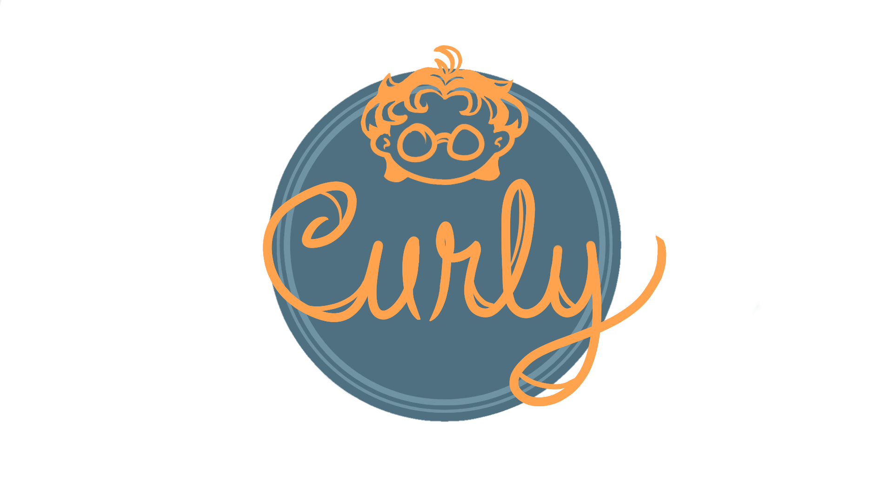

<div align="center">
    <h1>Curly</h1>
    <p>
        Curly is a lightweight unity template that promotes solid architecture, and removes the redundancy of implementing systems found in almost all games. As of now, Curly is not production-ready.
    </p>
</div>

<br></br>

## Mission
Too often do Unity projects devolve into a architectural mess. Developers of all experience fail to think about how they are structuring their systems, or even overcomplicate their architecture. Curly provides a set of prebuilt systems, file structure, and flexible utilities to help allieviate this.

Curly utilizes a primarily ScriptableObject based architecture for it's core systems, and makes little use of monobehaviors. For developers, this means to get your game up and running doesn't require a million prefabs in a single scene to handle your systems. Instead, it is all handled using an easy-to-understand ```App``` class!

## Features
Curly comes prebuilt with a:
* Configurable App and Bootstrap system
* Scene Management, Audio Management, and Input Management systems
* Useful property drawers, custom editors, and more!
* Unity-specific and general C# utiliites
* A scalable file architecture
* A custom logger that makes debugging a breeze

## Users
Curly is aimed for Unity developers with an intermediate or above programming knowledge, and with a preference to work with code over the Unity Editor. That being said, however, Curly is not exclusive to these developers. Curly is lightweight, and it's innerworkings are very modularized! This means that deleting entire systems have very little impact on how Curly works. Feel free to swap out and improve systems as you please!

## Disclaimer
Using Curly is not a guarantee that your game will have superb code quality, fun gameplay, or any likewise promises. Rather, Curly is a starting point for development, and should be treated as such.

## Dependencies
The following packages are used in Curly. These packages should be automatically installed by Unity.
* [DOTween](https://assetstore.unity.com/packages/tools/animation/dotween-hotween-v2-27676)
* [Unity Addressables](https://docs.unity3d.com/Packages/com.unity.addressables@1.19/manual/index.html)
* [New Unity Input System](https://docs.unity3d.com/Packages/com.unity.inputsystem@1.5/manual/index.html)
* [Serializable Dictionary](https://assetstore.unity.com/packages/tools/integration/serializabledictionary-90477)